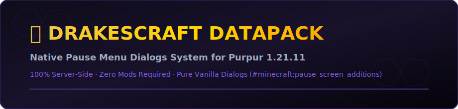

<div align="center">



# 🐲 DrakesCraft DataPack (Purpur 1.21.11)

**Native Server-Side Pause Menu Dialogs System for DrakesCraft Network**

[](https://drakescraft.cl)
[](https://purpurmc.org)
[](https://github.com/DrakesCraft-Labs)

</div>

---

## 🌟 Overview

The **DrakesCraft DataPack** utilizes Minecraft 1.21.11's native **Dialogs** engine and `#minecraft:pause_screen_additions` tag system to inject a custom, interactive GUI directly into the player's Escape (Pause) menu.

**Zero Client Mods Required!** Works natively out of the box for all Java Edition 1.21.11 players joining `mc.drakescraft.cl`.

---

## 📁 Menu Architecture

* 🏠 **Homes & Teleportation (`teleport_menu.json`):** `/spawn`, `/rtp`, `/back`, `/tpaccept`, `/tpdeny`, plus text inputs for `/home <name>`, `/sethome <name>`, `/delhome <name>`, and `/tpa <player>`.
* 🛡️ **ProtectionStones (`protection_menu.json` & `protection_flags_menu.json`):** `/ps home`, `/ps view`, `/ps info`, `/ps list`, `/ps add <player>`, `/ps remove <player>`, plus plot flags (`pvp`, `mob-spawning`, `entry`, `chest-access`, `use`, `damage-animals`, `fire-spread`, `tnt`, greeting/farewell).
* 💰 **Economy & Auctions (`economy_menu.json` & `pay_menu.json`):** `/bal`, `/baltop`, `/ah`, `/tienda`, with dynamic inputs for `/ah sell <price>` and `/pay <player> <amount>`.
* 🎁 **Kits & Rewards (`kits_menu.json`):** `/kit`, `/daily`, `/vote`, `/claim`.
* 💬 **Chat Placeholders (`chat_placeholders_menu.json`):** One-click sharing for `[i]`, `[inv]`, `[ec]`, `[money]`, `[ping]`, and `[coords]`.
* ⚡ **Utilities (`utilities_menu.json`):** `/ec`, `/craft`, `/trash`, `/afk`, `/ping`, `/stats`, `/playtime`, `/msg <player> <message>`.
* 🧪 **Slimefun (`slimefun_menu.json`):** `/sf guide` and `/sf stats`.
* ⭐ **Special Rank Perks (`rank_menu.json`):** Exclusive commands (`/fly`, `/hat`, `/feed`, `/heal`, `/anvil`, `/near`, `/ptime`, `/pweather`, `/nick <nickname>`) for **VIP / OldSchool** ranks.
* 👑 **Staff & Moderation (`staff_menu.json`):** Admin tools (`/v`, `/invsee <player>`, `/enderchest <player>`, `/tp <player>`, `/gamemode`, `/co i`, `/kick`, `/ban`, `/mute`) protected by **LuckPerms**.

---

## 🚀 Installation

1. Copy the `DrakesCraft_DataPack` directory into your world's datapacks folder:
   ```text
   <server-root>/world/datapacks/DrakesCraft_DataPack
   ```
2. Execute `/reload` in-game or restart your Purpur 1.21.11 server.
3. Open the pause menu in-game to access the **DrakesCraft** hub!

---

<div align="center">

**DrakesCraft Labs** · Chile · Led by [**JackStar6677-1**](https://github.com/JackStar6677-1)

</div>
