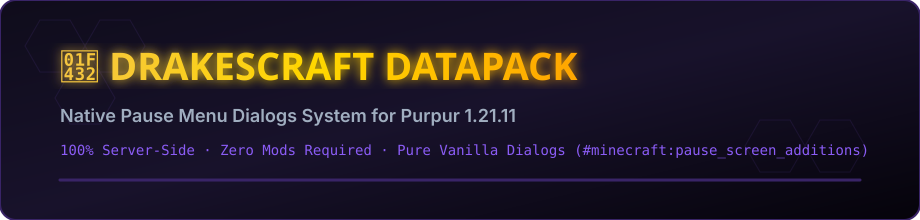

<div align="center">



# DrakesCraft DataPack (Purpur 1.21.11)

**Native Server-Side Pause Menu Dialogs System for DrakesCraft Network**

[](https://drakescraft.cl)
[](https://purpurmc.org)
[](https://github.com/DrakesCraft-Labs)

</div>

---

## Overview

The **DrakesCraft DataPack** utilizes Minecraft 1.21.11's native **Dialogs** engine and `#minecraft:pause_screen_additions` tag system to inject a custom, interactive GUI directly into the player's Escape (Pause) menu.

**Zero Client Mods Required!** Works natively out of the box for all Java Edition 1.21.11 players joining `mc.drakescraft.cl`.

---

## Menu Architecture

* **Jugadores (`teleport_menu.json`, `protection_menu.json`, `economy_menu.json`, `kits_menu.json`, `utilities_menu.json`):** spawn, hogares, TPA, ProtectionStones, economia, `/kit`, `/kit inicial`, AFK, ping, tiempo jugado y mensajes privados.
* **Guia de chat (`chat_placeholders_menu.json`):** explica los tags `[i]`, `[inv]`, `[ec]`, `[money]`, `[ping]` y `[coords]`. Los tags se escriben en el chat normal, nunca mediante `/say`.
* **Rangos (`rank_menu.json`):** herramientas premium como `/fly`, `/hat`, `/feed`, `/heal`, `/anvil`, `/ec`, `/craft`, `/trash`, `/near`, `/ptime`, `/pweather` y `/nick`. LuckPerms decide el acceso real.
* **Slimefun (`slimefun_menu.json`):** `/sf guide` y `/sf stats`.
* **Staff (`staff_menu.json`):** `/vani`, inspeccion, moderacion y gamemodes. LuckPerms protege todas las acciones.

El datapack es una interfaz; no concede permisos. Los kits los declara y valida Odysseia, no Essentials.

---

## Installation

1. Copy the `DrakesCraft_DataPack` directory into your world's datapacks folder:
   ```text
   <server-root>/world/datapacks/DrakesCraft_DataPack
   ```
2. Execute `/reload` in-game or restart your Purpur 1.21.11 server.
3. Open the pause menu in-game to access the **DrakesCraft** hub!

---

## Mojang 1.21.11 Dialog Codec

The pack targets data pack format `94.1`. Menus use `minecraft:multi_action`,
`actions`, and `minecraft:show_dialog` for navigation:

```json
{
  "type": "minecraft:multi_action",
  "title": {
    "text": "Titulo del menu",
    "bold": true,
    "color": "gold"
  },
  "body": {
    "type": "minecraft:plain_message",
    "contents": {
      "text": "Menu description or instructions here."
    }
  },
  "inputs": [
    {
      "type": "minecraft:text",
      "key": "input_key",
      "label": {
        "text": "Input Label:"
      }
    }
  ],
  "actions": [
    {
      "label": {"text": "Open economy"},
      "action": {
        "type": "minecraft:show_dialog",
        "dialog": "drakescraft:economy_menu"
      }
    }
  ]
}
```

Run `python scripts/validate_datapack.py` before deployment. The validator checks
pack version, JSON structure, input keys, action payloads, every internal dialog
reference, and client-unsafe decorative symbols. Dialog text intentionally uses
plain client-safe labels so it renders equally on supported resource packs.

## Production Compatibility Tools

DrakesCraft also ships a reproducible repair for the third-party **Villages
Revamped 1.21.11 v2.7** archive. That release contains six swamp jigsaw blocks
which incorrectly reference the nonexistent `minecraft:village/swamp/decor`
and `minecraft:village/swamp/streets` pools. On Purpur 1.21.11 this produces
missing-template-pool warnings while new terrain is generated.

Run the tool against a backed-up source archive and deploy only its verified
output:

```bash
python -m venv .venv-tools
.venv-tools/bin/pip install -r requirements-tools.txt
.venv-tools/bin/python scripts/patch_villages_revamped.py \
  "Villages Revamped 1.21.11 v2.7.fixed.zip" \
  "Villages Revamped 1.21.11 v2.7.fixed2.zip"
```

The patcher changes only those six NBT pool values, preserves every other ZIP
entry, checks the expected correction count, scans for stale namespaces, and
runs a ZIP integrity test before reporting success.

---

<div align="center">

**DrakesCraft Labs** · Chile · Led by [**JackStar6677-1**](https://github.com/JackStar6677-1)

</div>
